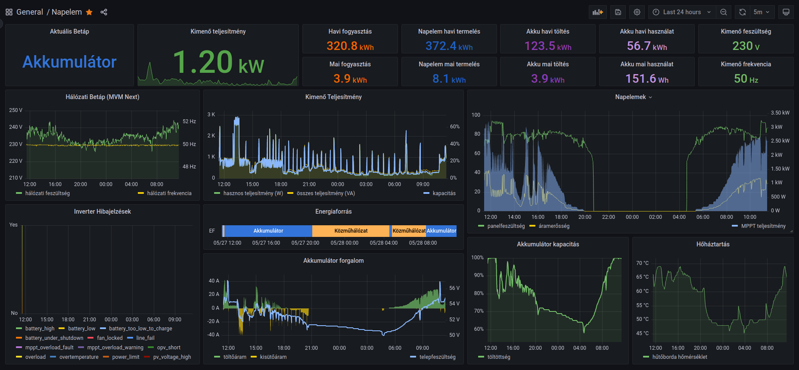

# Solar Inverter Controller for inverters based on Voltronic protocol

The main goals of this software is to provide monitoring and control to Voltronic solar inverters in an open source and container native way. It can read metrics form the inverter and write it to an influxdb database, and can write inverter settings from a yaml configuration file to the inverter. The configuration file is monitored for changes and apply any changes without reload.

Tested and in production use on a Growatt 3000-24 SPL and a Growatt 5000 SL solar inverter.

May be working on Voltronic Axpert series inverters and related OEM brand names.



## Building docker container image
```sh
docker build . -f docker/Dockerfile -t solar:latest
```

## Starting external dependencies
```sh
docker run -dt --name influx --restart unless-stopped \
  --network host \
  --volume /srv/influx/db:/var/lib/influxdb \
  influxdb:1.8.4-alpine

docker run -dt --name grafana --restart unless-stopped \
  --network host \
  --volume /srv/grafana/lib:/var/lib/grafana \
  --volume /srv/grafana/etc:/etc/grafana \
  --volume /srv/grafana/log:/var/log/grafana \
  grafana/grafana:latest
```
Recommended to use better network topology or a firewall in production.

There is an example grafana dashboard in the grafana subdirectory. You need to add an influxdb data source pointed towards the installed influxdb instance to work.

## Running Solar Inverter Controller
Preload the built docker image on the runner machine.
Place the customized configuration file in the /srv/solar directory.

```sh
docker run -d --name solar --restart unless-stopped \
  --env CONFIG=/cfg/config.yaml \
  --volume /srv/solar:/cfg \
  --device /dev/ttyUSB0:/dev/ttyUSB0 \
  solar:latest
```

There is environment variables to configure the influxdb connection, defaulted to localhost:8086. Please see src/influxdbhandler.py.
